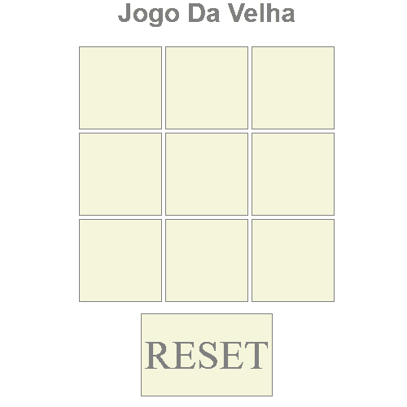

# Jogo Da Velha

Projeto desenvolvido no curso do programadorBR

 

  

  <a href="#tecnologias-utilizadas-no-curso">Tecnologias utilizadas no curso</a>

## Tecnologias utilizadas no curso

No curso o projeto foi desenvolvido utilizando as seguintes tecnologias:

- HTML
- CSS
- JavaScript
